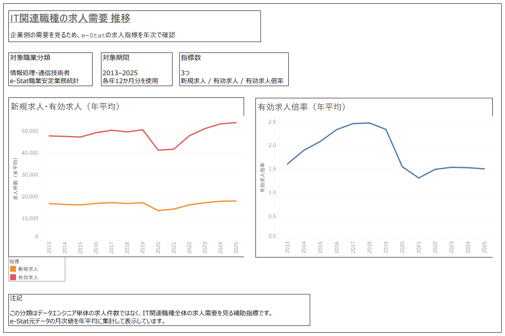

# ITエンジニア市場データELTプロジェクト

## 概要

ITエンジニア職種に関する検索関心データと求人需要データを収集し、Python・BigQuery SQL・Looker Studioを用いて、データ取得から可視化までの流れを構築したポートフォリオです。

主成果物は、Looker Studioで作成した可視化レポートです。  
GitHubでは、データ取得、前処理、SQL変換、検証、ドキュメントを公開しています。

また、同じ加工済みデータをAWS S3 / Athena上にも配置し、Tableau DesktopからAthenaへ接続するBI可視化構成も追加しています。  
これにより、BigQuery / Looker Studioだけでなく、AWS上のデータをSQLで参照し、外部BIツールから可視化する構成も確認できるようにしています。

---

## 成果物

- [Looker Studio 可視化レポート](https://datastudio.google.com/s/rtdgPX5x7S0)
- [詳細設計書](docs/technical_design.md)
- [テーブル定義](docs/table_definition.md)
- [BIレポート構成](docs/bi_report_summary.md)
- [Tableauダッシュボード画像](images/tableau_aws_athena_job_market_dashboard.png)
- [Tableauワークブック](tableau/engineer_market_aws_athena_tableau.twbx)

Looker Studioでは、以下を1つのレポートとして整理しています。

- 分析の問い
- データソースとELT構成
- IT関連職種の求人需要
- 職種名への検索関心
- 未経験IT職関連KWの検索関心
- 公開データから分かること・分からないこと
- 可視化・実装で意識したこと

Tableauでは、AWS S3 / Athena上のe-Stat求人指標データを参照し、以下の年次推移を可視化しています。

- 新規求人（年平均）
- 有効求人（年平均）
- 有効求人倍率（年平均）

---

## このポートフォリオで示したこと

- 外部データをPythonで前処理し、BigQueryへ取り込む流れ
- BigQuery上で `raw → staging → mart` の層を分けたデータ設計
- Google Trendsの取得グループ差を考慮した補正
- 検証SQLによる件数、期間、重複の確認
- Looker Studioで、分析の問いから結果・限界まで伝える可視化レポートの作成
- Amazon S3上のCSVをAthena外部テーブルとして定義し、SQLで参照する構成
- AWS Glue Data Catalogを介したAthenaテーブル管理
- Tableau DesktopからAmazon Athenaへ接続し、AWS上のデータをBI可視化する流れ

---

## 使用データ

| データ | 内容 |
|---|---|
| Google Trends | IT職種名・未経験IT職関連キーワードの検索関心指数 |
| e-Stat 職業安定業務統計 | 情報処理・通信技術者の新規求人、有効求人、有効求人倍率 |

対象期間は、2013年1月〜2025年12月です。

---

## 使用技術

### データ処理・DWH・BI

- Python
- Docker
- BigQuery
- BigQuery Standard SQL
- Looker Studio
- Tableau Desktop
- Git / GitHub
- Markdown

### AWS拡張

- Amazon S3
- Amazon Athena
- AWS Glue Data Catalog
- IAM

---

## データ処理・可視化フロー

### BigQuery / Looker Studio版

```text
raw data
  ↓
Python preprocessing
  ↓
processed CSV
  ↓
BigQuery raw tables
  ↓
BigQuery staging tables
  ↓
BigQuery mart tables
  ↓
Looker Studio
```

### AWS / Athena / Tableau版

```text
processed CSV
  ↓
Amazon S3
  ↓
AWS Glue Data Catalog
  ↓
Amazon Athena external tables
  ↓
Athena views
  ↓
Tableau Desktop
```

---

## AWS / Athena / Tableau による拡張実装

本プロジェクトでは、BigQuery / Looker Studio による可視化に加えて、AWS環境でのデータ参照・BI接続も実装しました。

加工済みのe-Stat求人指標CSVをAmazon S3に配置し、Amazon Athenaの外部テーブルとして定義しています。  
Athena上では、複数CSVを統合するViewと、Tableau接続用の横持ちViewを作成し、Tableau DesktopからAthenaへ接続して求人需要の年次推移を可視化しました。



### Tableauで可視化した指標

| 指標 | 集計方法 | 補足 |
|---|---|---|
| 新規求人 | 年平均 | e-Stat元データの月次値を年平均に集計 |
| 有効求人 | 年平均 | e-Stat元データの月次値を年平均に集計 |
| 有効求人倍率 | 年平均 | 倍率のため合計ではなく平均で集計 |

※ 「情報処理・通信技術者」はデータエンジニア単体ではなく、IT関連職種全体の求人需要を見る補助指標です。

### Athena SQL

Athenaで使用したSQLは以下に配置しています。

- `aws/athena/01_create_external_tables.sql`
- `aws/athena/02_create_views.sql`
- `aws/athena/03_validation_queries.sql`

SQL内のS3パスは、公開リポジトリ上ではプレースホルダーを使用しています。  
実行時は、自身のS3バケット名に置き換える想定です。

### 補足：IAM権限について

TableauからAthenaへ接続する検証では、接続確認を優先してAWS管理ポリシーを使用しました。  
実運用では、対象S3バケットおよびAthenaクエリ結果出力先に限定した最小権限へ変更する想定です。

---

## ディレクトリ構成

```text
data/
  raw/          # 取得元データ
  processed/    # Python前処理後のCSV

python/         # e-Stat前処理スクリプト

sql/            # BigQuery用SQL
  01_create_tables.sql
  05_transform_search_trends.sql
  06_transform_estat_job_market.sql
  07_create_mart_tables.sql
  08_validation_checks.sql

aws/
  athena/       # Amazon Athena用SQL
    01_create_external_tables.sql
    02_create_views.sql
    03_validation_queries.sql

images/         # README掲載用画像
  tableau_aws_athena_job_market_dashboard.png

tableau/        # Tableauワークブック
  engineer_market_aws_athena_tableau.twbx

docs/           # 詳細設計・テーブル定義・BI構成メモ
```

---

## 補足

本プロジェクトでは、公開統計と検索関心データを用いて、IT関連職種全体の求人需要と検索関心の推移を確認しました。

一方で、公開統計と検索関心データだけでは、データエンジニア単体の求人件数、未経験歓迎求人の実数、年収レンジ、必須スキル、勤務地などは判断できません。

そのため、可視化レポートでは、分析結果だけでなく「このデータで分かること・分からないこと」も整理しています。
